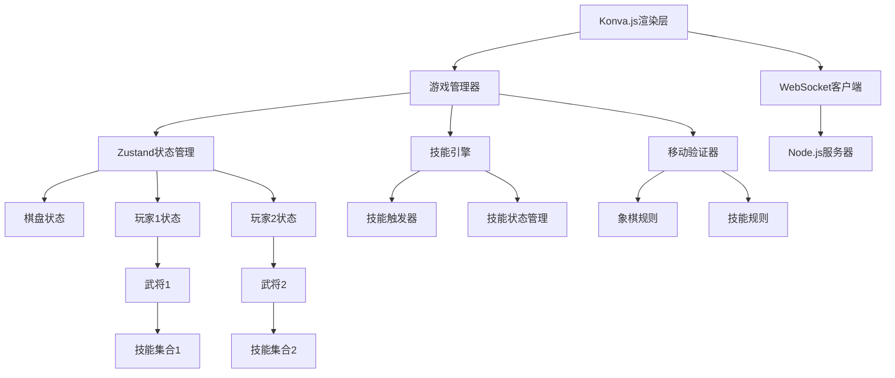

# 设计文档

## 概述

二国杀象棋是一个基于Web的棋类游戏，结合了传统象棋的规则和三国杀的武将技能系统。游戏采用现代化技术栈和模块化架构设计，专为象棋游戏优化。

### 现代化技术栈（专为象棋游戏优化）

**核心框架**：
- **Next.js 14** - React全栈框架，支持SSR/SSG，优化SEO和首屏加载
- **TypeScript 5.x** - 最新类型系统，提供完整类型安全
- **Tailwind CSS** - 原子化CSS，快速响应式设计

**游戏渲染引擎**：
- **Konva.js + React-Konva** - 高性能2D Canvas库，专为游戏优化
- **Framer Motion** - 流畅动画库，棋子移动和技能效果
- **React Spring** - 物理动画，增强交互体验

**状态管理**：
- **Zustand** - 轻量级状态管理，比Redux更简洁
- **React Query (TanStack Query)** - 服务器状态管理和缓存

**实时通信**：
- **Socket.IO 4.x** - WebSocket通信，支持房间和事件
- **WebRTC** - P2P连接（可选，减少服务器负载）

**UI组件库**：
- **Radix UI** - 无样式组件库，完全可定制
- **Lucide React** - 现代图标库
- **React Hot Toast** - 优雅的通知系统

**开发工具**：
- **Vite** - 极速构建工具
- **Vitest** - 现代测试框架
- **Playwright** - E2E测试
- **Storybook** - 组件开发和文档

**部署和监控**：
- **Vercel** - 无服务器部署
- **Sentry** - 错误监控
- **Vercel Analytics** - 性能分析

### 核心设计理念

- **分离关注点**: 游戏逻辑、UI渲染、技能系统相互独立
- **可扩展性**: 支持轻松添加新武将和技能
- **类型安全**: 使用TypeScript确保编译时类型检查
- **事件驱动**: 基于事件系统处理游戏状态变化和技能触发
- **响应式设计**: 支持不同屏幕尺寸的设备
- **性能优化**: 使用现代渲染技术确保流畅体验

## 架构

### 整体架构图



### 分层架构

1. **表现层 (Presentation Layer)**
   - Konva.js渲染引擎
   - React组件系统
   - Framer Motion动画

2. **业务逻辑层 (Business Logic Layer)**
   - 游戏管理器
   - 技能引擎
   - 移动验证器

3. **数据层 (Data Layer)**
   - Zustand状态管理
   - React Query缓存
   - WebSocket通信

## 组件和接口

### 核心接口定义

```typescript
// 基础游戏实体
interface Position {
  x: number;
  y: number;
}

interface Piece {
  id: string;
  type: PieceType;
  color: PlayerColor;
  position: Position;
  isAlive: boolean;
}

interface Player {
  id: string;
  color: PlayerColor;
  hero: Hero;
  pieces: Piece[];
}

// 武将系统
interface Hero {
  id: string;
  name: string;
  skills: Skill[];
  awakened: boolean;
}

interface Skill {
  id: string;
  name: string;
  type: SkillType;
  description: string;
  isUsed: boolean;
  canUse(): boolean;
  execute(context: GameContext): SkillResult;
}

// 游戏状态
interface GameState {
  board: Board;
  players: [Player, Player];
  currentPlayer: PlayerColor;
  gamePhase: GamePhase;
  moveHistory: Move[];
}
```

### 现代化渲染架构（基于Konva.js）

**为什么选择Konva.js**：
- 专为游戏和交互应用设计的2D Canvas库
- 支持分层渲染，棋盘、棋子、特效可独立管理
- 内置拖拽、动画、事件处理
- 优秀的性能，支持大量游戏对象
- 与React完美集成

```typescript
// 游戏渲染层次结构
interface GameLayers {
  backgroundLayer: Konva.Layer;    // 棋盘背景
  gridLayer: Konva.Layer;          // 网格线
  pieceLayer: Konva.Layer;         // 棋子
  highlightLayer: Konva.Layer;     // 高亮和选择效果
  effectLayer: Konva.Layer;        // 技能特效和动画
  uiLayer: Konva.Layer;            // UI元素（按钮等）
}

// React-Konva组件示例
const ChessBoard: React.FC = () => {
  return (
    <Stage width={800} height={900}>
      <Layer name="background">
        <BoardBackground />
      </Layer>
      <Layer name="pieces">
        {pieces.map(piece => (
          <ChessPiece 
            key={piece.id} 
            piece={piece}
            onDragEnd={handlePieceMove}
          />
        ))}
      </Layer>
      <Layer name="effects">
        <SkillEffects />
      </Layer>
    </Stage>
  );
};
```

### 现代化动画系统

```typescript
// 使用Framer Motion的棋子移动动画
const AnimatedPiece = motion.custom(Konva.Image);

const ChessPiece: React.FC<PieceProps> = ({ piece, position }) => {
  return (
    <AnimatedPiece
      animate={{ 
        x: position.x * CELL_SIZE, 
        y: position.y * CELL_SIZE 
      }}
      transition={{ 
        type: "spring", 
        stiffness: 300, 
        damping: 30 
      }}
      whileHover={{ scale: 1.1 }}
      whileTap={{ scale: 0.95 }}
    />
  );
};

// 技能特效动画
const SkillEffect: React.FC<SkillEffectProps> = ({ effect }) => {
  return (
    <motion.div
      initial={{ opacity: 0, scale: 0.5 }}
      animate={{ opacity: 1, scale: 1 }}
      exit={{ opacity: 0, scale: 0.5 }}
      transition={{ duration: 0.3 }}
    >
      <ParticleSystem effect={effect} />
    </motion.div>
  );
};
```

### 状态管理（Zustand）

```typescript
interface GameStore {
  gameState: GameState;
  selectedPiece: Piece | null;
  validMoves: Position[];
  isOnline: boolean;
  
  // Actions
  selectPiece: (piece: Piece) => void;
  movePiece: (from: Position, to: Position) => void;
  useSkill: (skillId: string) => void;
  connectToRoom: (roomId: string) => void;
}

const useGameStore = create<GameStore>((set, get) => ({
  gameState: initialGameState,
  selectedPiece: null,
  validMoves: [],
  isOnline: false,
  
  selectPiece: (piece) => set({ 
    selectedPiece: piece,
    validMoves: getValidMoves(piece, get().gameState)
  }),
  
  movePiece: (from, to) => {
    const state = get();
    if (state.isOnline) {
      // 发送到服务器
      socket.emit('move', { from, to });
    } else {
      // 本地游戏
      set(state => ({
        gameState: applyMove(state.gameState, from, to),
        selectedPiece: null,
        validMoves: []
      }));
    }
  }
}));
```

### UI组件架构（基于Radix UI）

```typescript
// 现代化组件设计
const HeroSelectionDialog: React.FC = () => {
  return (
    <Dialog.Root>
      <Dialog.Trigger asChild>
        <Button className="bg-gradient-to-r from-blue-500 to-purple-600">
          选择武将
        </Button>
      </Dialog.Trigger>
      
      <Dialog.Portal>
        <Dialog.Overlay className="fixed inset-0 bg-black/50" />
        <Dialog.Content className="fixed top-1/2 left-1/2 transform -translate-x-1/2 -translate-y-1/2">
          <HeroGrid heroes={availableHeroes} />
        </Dialog.Content>
      </Dialog.Portal>
    </Dialog.Root>
  );
};

// 技能面板组件
const SkillPanel: React.FC<SkillPanelProps> = ({ hero }) => {
  return (
    <div className="space-y-4">
      {hero.skills.map(skill => (
        <Tooltip.Root key={skill.id}>
          <Tooltip.Trigger asChild>
            <Button 
              variant={skill.canUse() ? "default" : "disabled"}
              onClick={() => useSkill(skill.id)}
              className="w-full"
            >
              {skill.name}
            </Button>
          </Tooltip.Trigger>
          
          <Tooltip.Content>
            <p className="max-w-xs">{skill.description}</p>
          </Tooltip.Content>
        </Tooltip.Root>
      ))}
    </div>
  );
};
```

## 数据模型

### 棋盘表示

```typescript
class Board {
  private grid: (Piece | null)[][];
  private readonly BOARD_SIZE = { width: 9, height: 10 };

  getPiece(position: Position): Piece | null;
  setPiece(position: Position, piece: Piece | null): void;
  isValidPosition(position: Position): boolean;
  isInPalace(position: Position, color: PlayerColor): boolean;
  hasRiverCrossed(position: Position, color: PlayerColor): boolean;
}
```

### 武将技能实现

每个武将的技能都实现统一的接口，但具有不同的执行逻辑：

```typescript
// 项羽 - 背水技能
class BeishuiSkill implements Skill {
  id = "xiangyu_beishui";
  name = "背水";
  type = SkillType.PASSIVE;
  
  canUse(): boolean {
    return true; // 被动技能始终可用
  }
  
  execute(context: GameContext): SkillResult {
    const { piece, move } = context;
    if (piece.type === PieceType.PAWN && !this.hasCrossedRiver(piece)) {
      // 允许兵一步过河
      return { success: true, modifiedMove: this.allowDirectRiverCrossing(move) };
    }
    return { success: false };
  }
}

// 刘邦 - 亲征技能
class QinzhengSkill implements Skill {
  id = "liubang_qinzheng";
  name = "亲征";
  type = SkillType.LIMITED;
  isUsed = false;
  
  canUse(): boolean {
    return !this.isUsed;
  }
  
  execute(context: GameContext): SkillResult {
    const { gameState } = context;
    this.isUsed = true;
    
    // 强制对方将与己方将在同一条线
    const result = this.forceKingAlignment(gameState);
    return { success: true, gameStateChanges: result };
  }
}
```

### 网络通信架构

```typescript
// WebSocket事件定义
interface SocketEvents {
  // 客户端发送
  'join-room': (roomId: string) => void;
  'move': (move: { from: Position; to: Position }) => void;
  'use-skill': (skillId: string) => void;
  'select-hero': (heroId: string) => void;
  
  // 服务器发送
  'game-state': (gameState: GameState) => void;
  'player-joined': (player: Player) => void;
  'move-result': (result: MoveResult) => void;
  'skill-used': (result: SkillResult) => void;
  'error': (error: GameError) => void;
}

// Socket.IO客户端
class GameSocket {
  private socket: Socket<SocketEvents>;
  
  constructor() {
    this.socket = io('/game');
    this.setupEventHandlers();
  }
  
  private setupEventHandlers() {
    this.socket.on('game-state', (gameState) => {
      useGameStore.getState().updateGameState(gameState);
    });
    
    this.socket.on('move-result', (result) => {
      if (result.success) {
        // 播放移动动画
        playMoveAnimation(result.move);
      } else {
        // 显示错误提示
        toast.error(result.error);
      }
    });
  }
}
```

## 正确性属性

*属性是一个特征或行为，应该在系统的所有有效执行中保持为真——本质上，是关于系统应该做什么的正式陈述。属性作为人类可读规范和机器可验证正确性保证之间的桥梁。*

基于需求分析，以下是系统必须满足的正确性属性：

### 属性 1: 回合制移动规则
*对于任何* 游戏状态，只有当前回合的玩家才能移动己方棋子，移动后回合应该切换到对方玩家
**验证: 需求 1.3**

### 属性 2: 移动合法性验证
*对于任何* 棋子移动请求，系统必须验证移动的合法性（包括基础象棋规则和武将技能修改），只有合法移动才能被执行
**验证: 需求 1.4, 3.1-3.5, 4.1-4.5, 5.2-5.4**

### 属性 3: 武将技能状态管理
*对于任何* 武将技能，系统必须正确管理其状态（限定技只能使用一次，觉醒技满足条件后激活，锁定技自动触发）
**验证: 需求 9.1, 9.2, 9.3**

### 属性 4: 项羽背水技能效果
*对于任何* 项羽的兵，未过河时可以一步直接过河，过河后每次移动可以连走两步但最多前进一步
**验证: 需求 3.1, 3.2**

### 属性 5: 项羽霸王技能效果
*对于任何* 项羽的马，移动时不受拌马腿影响（除非马受攻击），且不能连续两步都跳马
**验证: 需求 3.3, 3.5**

### 属性 6: 刘邦技能综合效果
*对于任何* 刘邦的棋子，将可以出九宫，士可以出九宫但不能过河，象不受象心限制
**验证: 需求 4.1, 4.4, 4.5**

### 属性 7: 刘邦亲征技能效果
*对于任何* 刘邦使用亲征技能的情况，必须强制对方将与己方将在同一条线上，并清除路径上的阻挡
**验证: 需求 4.2, 4.3**

### 属性 8: 韩信兵标记系统
*对于任何* 韩信的兵标记操作，消耗标记放置兵必须在河内，获得标记的条件必须是能过河的棋子被移除
**验证: 需求 5.2, 5.5**

### 属性 9: 韩信用兵技能效果
*对于任何* 韩信使用用兵技能的情况，任意己方棋子都可以与兵交换位置
**验证: 需求 5.4**

### 属性 10: 萧何月下技能效果
*对于任何* 萧何使用月下技能的情况，指定的在场棋子和已离场棋子必须在下回合回到开局位置
**验证: 需求 6.1**

### 属性 11: 萧何败也技能效果
*对于任何* 萧何移动将的情况，必须强制再移动一步将，且第二次移动必须合法
**验证: 需求 6.3, 6.4**

### 属性 12: 张良运筹技能效果
*对于任何* 张良移动将后的情况，可以再移动除车以外的一个己方棋子
**验证: 需求 7.1**

### 属性 13: 张良决胜技能效果
*对于任何* 张良第一次被叫将的情况，可以连续移动两次将
**验证: 需求 7.2**

### 属性 14: 樊哙舞剑技能效果
*对于任何* 樊哙使用舞剑技能的情况，同名棋子与对方棋子必须相互击杀
**验证: 需求 8.1**

### 属性 15: 樊哙护主技能效果
*对于任何* 樊哙的将被攻击的情况，将必须退回上一步位置，攻击棋子回到初始位置
**验证: 需求 8.2, 8.3**

### 属性 16: UI状态同步
*对于任何* 游戏状态变化，用户界面必须实时反映当前状态（可移动棋子高亮、可用技能显示、棋子位置更新）
**验证: 需求 10.2, 10.3, 10.4, 10.5**

## 错误处理

### 错误类型定义

```typescript
enum GameErrorType {
  INVALID_MOVE = "invalid_move",
  SKILL_NOT_AVAILABLE = "skill_not_available",
  GAME_STATE_INVALID = "game_state_invalid",
  HERO_NOT_FOUND = "hero_not_found",
  NETWORK_ERROR = "network_error"
}

interface GameError {
  type: GameErrorType;
  message: string;
  context?: any;
}
```

### 错误处理策略

1. **移动验证错误**
   - 非法移动：使用React Hot Toast显示错误提示
   - 技能冲突：提供解决方案或回退选项

2. **技能执行错误**
   - 技能不可用：禁用技能按钮，显示原因
   - 技能执行失败：回滚游戏状态，记录错误

3. **网络错误**
   - 连接断开：自动重连机制
   - 同步失败：状态回滚和重新同步

4. **用户输入错误**
   - 无效操作：视觉反馈和操作指导
   - 超时操作：自动跳过回合或提示用户

## 测试策略

### 现代化测试框架

**测试工具选择**：
- **Vitest** - 现代单元测试框架，比Jest更快
- **fast-check** - 属性测试库
- **React Testing Library** - 组件测试
- **Playwright** - E2E测试
- **MSW (Mock Service Worker)** - API模拟

### 双重测试方法

**单元测试**：
- 验证特定示例和边界情况
- 测试各个组件的集成点
- 验证错误条件和异常处理
- 测试用户界面交互

**基于属性的测试**：
- 验证跨所有输入的通用属性
- 通过随机化提供全面的输入覆盖
- 测试游戏规则的一致性
- 验证技能系统的正确性

### 测试配置

```typescript
// Vitest配置示例
export default defineConfig({
  test: {
    environment: 'jsdom',
    setupFiles: ['./src/test/setup.ts'],
    globals: true,
  },
  plugins: [react()],
});

// 属性测试示例
describe('Chess Rules', () => {
  it('should validate all moves correctly', () => {
    fc.assert(fc.property(
      gameStateGenerator,
      moveGenerator,
      (gameState, move) => {
        const result = validateMove(move, gameState);
        // 验证移动结果的一致性
        expect(result.isValid).toBe(isLegalChessMove(move, gameState));
      }
    ), { numRuns: 1000 });
  });
});
```

### 性能测试

- 游戏响应时间 < 100ms
- 动画帧率 > 60fps
- 内存使用稳定，无泄漏
- 网络延迟处理 < 200ms

这种现代化的技术栈为象棋游戏提供了：
1. **优秀的性能** - Konva.js专为游戏优化
2. **流畅的动画** - Framer Motion提供专业级动画
3. **类型安全** - TypeScript 5.x最新特性
4. **开发体验** - Vite极速构建，热更新
5. **可维护性** - 模块化架构，清晰的状态管理
6. **扩展性** - 易于添加新功能和武将技能